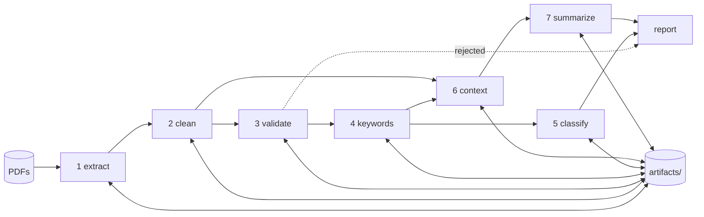

# Technical Design: Staged NLP Pipeline

**Version**: 3.0
**Date**: 2026-09-02
**Supersedes**: `cpu-nlp-pipeline-design.md` v2.0, which described the
single-pass build
**Related**: `docs/cpu-nlp-pipeline-prd.md` v2.0, `AGENTS.md`

## Summary

A rebuild of the CPU NLP pipeline as seven independent stages that write their
output to disk. Any stage can run alone, over one document or all of them, and
skips work whose inputs have not changed. The point is that changing a cleaning
regex should cost seconds, not a full re-run of Gemma over fifteen documents.

The main trade-off is that correct cache invalidation is genuinely fiddly, and
a cache that silently serves stale results is worse than no cache at all. Most
of the design below is about making invalidation hard to get wrong.

## Why staged

The v2 build re-ran everything on every change. On this corpus a full run is
minutes, which was survivable for a three day assessment and is not survivable
for an evaluation that will be re-run dozens of times across page modes, guard
settings, backends, devices, and thread counts.

Three properties matter now:

1. **Resumable.** A crash on document nine does not discard documents one to
   eight, and neither does a keyboard interrupt.
2. **Selectively invalidated.** Editing the summarization prompt must not
   invalidate keyword extraction. Editing a cleaning regex must invalidate
   everything downstream of it.
3. **Stage-major.** Run one stage across all documents, then release the model,
   then run the next. Peak memory becomes the largest single model instead of
   the sum, and each stage's timing is measured without another model's
   allocations polluting it.

## Constraints and Assumptions

| Constraint | Value | Source |
|---|---|---|
| Reference machine | Ryzen 5 5600H, 6 physical cores, 16GB, Windows 11 | measured in v2 |
| Corpus | 15 PDFs today, expected to grow | measured |
| Peak RSS budget | under 6GB per stage | assumed |
| Artifact store size | tens of MB, text only, no model weights | assumed |
| Denzel's code | not yet received | stated |
| Target server | Xeon or i9, exact spec unknown | assumed, blocking Phase 4 |

## Stage Architecture



Note two things in that graph. `context` depends on both `clean` and
`keywords`, not on `classify`, so classification and context building are
independent and could run in either order. And `classify` and `context` both
hang off `keywords`, which makes `keywords` the expensive invalidation point:
changing it costs three downstream stages.

### Stage contract

Every stage implements the same interface:

```python
class Stage(Protocol):
    name: str                      # "clean"
    version: str                   # bump by hand when logic changes
    depends_on: tuple[str, ...]    # upstream stage names
    config_keys: tuple[str, ...]   # config fields this stage reads

    def run(self, doc: DocContext) -> dict: ...
```

`config_keys` is the mechanism that keeps invalidation narrow. The summarize
stage declares `("SUMMARY_MAX_NEW_TOKENS", "REDUCED_CONTEXT_CHARS",
"INJECTION_GUARD", "GEMMA_GGUF", "DEVICE")` and nothing else, so changing
`ZEROSHOT_MAX_CHUNKS` leaves its cache intact. Declaring too many keys costs
you re-runs. Declaring too few silently serves stale output, which is the
failure this design most needs to avoid, so `config_keys` is checked in review
whenever a stage reads a new config value.

### Stages

| # | Stage | Owns | Model | Typical cost |
|---|---|---|---|---|
| 1 | extract | PDF to page-separated raw text | none | milliseconds |
| 2 | clean | boilerplate removal, title split | none | milliseconds |
| 3 | validate | accept or reject, with signals | none | milliseconds |
| 4 | keywords | 5 keyphrases, candidates, term frequency | SecureBERT | seconds |
| 5 | classify | label, confidence, all label scores | ModernBERT | seconds |
| 6 | context | sentence filter, reduced context | spaCy | milliseconds |
| 7 | summarize | one sentence | Gemma | seconds |

Stages 1 to 3 and 6 are cheap and pure. Stages 4, 5 and 7 hold models and are
the reason the cache exists. That split also means stages 1 to 3 and 6 can be
tested exhaustively without downloading a single model, which is what makes the
test suite fast enough to actually run.

## Artifact Store

```
artifacts/
  _index.json                    # doc_id -> source path, page count, status
  <doc_id>/
    00_source.json               # path, sha256, bytes, page count
    01_extract.json
    02_clean.json
    03_validate.json
    04_keywords.json
    05_classify.json
    06_context.json
    07_summarize.json
runs/
  <run_id>/
    results.json                 # assembled deliverable
    benchmark.json
    config.json                  # full resolved config for this run
```

`doc_id` is `sha256(pdf_bytes)[:16]`. Filename-independent, so renaming a PDF
does not orphan its artifacts, and two copies of the same PDF share one entry.

Every artifact file carries the same envelope:

```json
{
  "stage": "keywords",
  "stage_version": "2",
  "doc_id": "a3f0…",
  "input_fingerprint": "sha256 of upstream artifact fingerprints",
  "config_fingerprint": "sha256 of this stage's declared config keys",
  "code_fingerprint": "stage_version + module source hash",
  "created_at": "2026-09-02T…",
  "duration_s": 8.65,
  "payload": { }
}
```

A stage recomputes when any of the three fingerprints differs from what the
current run would produce, or when `--force` is passed. Otherwise it loads the
payload and reports `cached: true` so the run summary always shows how much was
actually computed.

**Code fingerprint.** Hashing the stage module's source means an edit
invalidates its own cache without anyone remembering to bump `stage_version`.
It is deliberately crude: it does not follow imports, so a change in a shared
helper will not invalidate a stage that calls it. That is what `stage_version`
is for, and forgetting to bump it is the most likely cache bug in this design.
The mitigation is boring and works: `--force` in CI, and `--force` before
publishing any number.

**What never gets cached.** Benchmark timings. A cached stage returns in
microseconds, and timing that would be meaningless. The benchmark command runs
with caching disabled, always, with no flag to change it.

## Configuration

One resolved config object per run, built from defaults and `NLP_*` environment
variables, written to `runs/<run_id>/config.json` before anything executes.

Flags carried forward from the evaluation work, all defaulting to reproduce
published numbers:

| Flag | Default | Purpose |
|---|---|---|
| `NLP_MAX_PAGES` | 0 (all) | 1 emulates the team's first-page-only pipeline |
| `NLP_INJECTION_GUARD` | true | off skips fence, hardening, output guard |
| `NLP_BACKEND` | torch | torch or onnx |
| `NLP_DEVICE` | cpu | cpu or cuda, encoders only |
| `NLP_ONNX_PROVIDER` | CPUExecutionProvider | execution provider |
| `NLP_ATTN_IMPL` | sdpa | forced for pre-Ampere cards |
| `NLP_CPU_THREADS` | physical cores | intra-op threads |
| `NLP_WORKERS` | 1 | parallel document processes |

The resolved config appears in `results.json` under `run`, not only in the
separate config file. A results file that does not carry its own configuration
becomes unattributable the moment a second mode exists, and this project now
has eight axes.

## Execution Model

```
python -m pipeline run                       # all stages, all docs, cached
python -m pipeline run --only clean,validate # two stages
python -m pipeline run --through keywords    # stages 1 to 4
python -m pipeline run --doc a3f0 --force    # one doc, ignore cache
python -m pipeline report                    # assemble results.json
python -m pipeline bench --stage classify    # timing, cache disabled
python -m pipeline compare --modes full,page1
```

**Stage-major, not document-major.** The runner iterates stages on the outside
and documents on the inside. Load SecureBERT once, embed all nine accepted
documents, release it, load ModernBERT. Document-major would reload models per
document or hold all three resident, and neither is acceptable at 16GB.

**Sequencing within a stage.** Documents are processed in `doc_id` order so runs
are deterministic and a partial run resumes predictably.

**Failure handling.** A stage failure on one document writes an artifact with
`status: "error"` and the traceback, and the run continues. Downstream stages
skip that document. Nothing kills a batch.

**Parallelism.** `NLP_WORKERS > 1` forks document-level workers inside a stage,
each with `NLP_CPU_THREADS` set low. This is the lever for the server question
and it is off by default. Memory multiplies by worker count, and at roughly
4.8GB peak that binds well before core count does, so the benchmark reports a
thread-by-worker grid with memory per cell rather than a throughput line.

## Data Model

`results.json`, assembled by the report command from artifacts:

```json
{
  "run": {
    "run_id": "2026-09-02T14-05-00Z",
    "mode": "optimized",
    "backend": "onnx", "device": "cpu",
    "onnx_provider": "CPUExecutionProvider",
    "max_pages": 0, "injection_guard": true,
    "cpu_threads": 6, "workers": 1,
    "gemma_gguf": "models_gguf/gemma-4-E2B_q4_0-it.gguf",
    "stage_versions": {"clean": "3", "keywords": "2"}
  },
  "environment": { "cpu": "", "cores_physical": 6, "ram_gb": 16,
                   "os": "", "python": "", "versions": {} },
  "documents": [
    {
      "doc_id": "a3f0…", "file": "…pdf",
      "pages_total": 7, "pages_read": 7,
      "status": "accepted",
      "reason": null,
      "signals": {"content_words": 812, "failure_signal": null,
                  "unique_word_ratio": 0.48},
      "keywords": [["non-human identities", 1.0]],
      "predicted_label": "…", "confidence": 0.721, "label_scores": {},
      "n_windows": 3,
      "reduced_context_chars": 1840, "sentences_kept": 12,
      "summary": "…", "output_guard_triggered": false,
      "prompt_tokens": 661, "generated_tokens": 41, "tokens_per_second": 3.05,
      "cached_stages": ["extract", "clean", "validate"]
    }
  ]
}
```

`sentences_kept` and `reduced_context_chars` are fields, not debug log lines.
When a summary is wrong, how much context it had is the first question anyone
asks, and in v2 that answer lived only in the log.

`cached_stages` makes it obvious at a glance whether a published number came
from a full computation.

## Repository Layout

```
pipeline/
  src/
    config.py           resolved config, NLP_* overrides, fingerprinting
    artifacts.py        store, envelopes, fingerprints, load/save
    runner.py           stage graph, stage-major loop, workers, resume
    models.py           lazy singletons with explicit release
    stages/
      __init__.py       STAGES registry, dependency order
      extract.py
      clean.py
      validate.py
      keywords.py
      classify.py
      context.py
      summarize.py
    segmentation.py     regex split, candidate building
    benchmark.py        warm-up, timed runs, median, RSS/VRAM sampling
    report.py           artifacts -> results.json
    compare.py          multi-mode diff tables
  tests/
    test_segmentation.py
    test_clean_validate.py
    test_context_injection.py
    test_cache.py
    fixtures/
  artifacts/
  runs/
  pdfs/
AGENTS.md
README.md
```

`models.py` holding the singletons, rather than each stage module, is what lets
the runner release a model between stages without every stage knowing about the
lifecycle.

## Testing

Fast suite, no model downloads, runs in seconds:

- **segmentation**: bridging bigrams absent, real bigrams present,
  abbreviations and decimals preserved, the fixed-width lookbehind compiles
- **clean and validate**: boilerplate fixtures, a short genuine article that
  must survive, a Cloudflare interstitial and a 403 page long enough to clear
  the word-count rule so validation rules 2 and 3 actually fire
- **context**: word-boundary matching (`ai` must not match `said`), fallback
  when nothing matches, injection fixture
- **cache**: editing a stage's config key invalidates that stage and everything
  downstream, and leaves upstream and unrelated stages alone

That last one is the test that keeps this design honest. Without it, cache
invalidation is a thing you believe rather than a thing you know.

Slow suite, models required, run before publishing numbers: one accepted
document end to end, asserting shape and non-emptiness rather than exact
values, since quantization moves the values around.

## Build Phases

### Phase 1: skeleton with no models

Config, artifact store with fingerprinting, runner, stages 1, 2, 3 and 6, plus
stubbed 4, 5 and 7 returning fixed values. Report command. Fast test suite,
including the cache invalidation test. This is deliberately the whole
infrastructure and none of the machine learning, because infrastructure written
around a model that is already there tends to grow the model's shape.

Done when `run` and `report` produce a complete `results.json` with stub values
and the cache test passes.

### Phase 2: real models

Stages 4, 5 and 7. SecureBERT embedder with mean pooling. Windowed
classification with length-weighted aggregation. Gemma through llama.cpp on the
q4_0 QAT weights. Injection defenses and the guard flag. Segmentation wired
into candidate generation.

Done when all fifteen PDFs produce the v2 results or better, with keyphrases
free of bridged bigrams.

### Phase 3: measurement

Benchmark harness with caching disabled. ONNX int8 backend. `MAX_PAGES` and the
mode comparison, including the effect on accept and reject decisions. Guard cost
measured.

Done when three timing tables and the first-page accuracy diff exist.

### Phase 4: hardware

Device flags, GPU runs with VRAM recorded, thread-by-worker grid on server
hardware. Blocked on Denzel's code and on hardware access.

## Architecture Decisions

### ADR-001: Artifact cache keyed on three fingerprints

- **Options**: no cache, timestamp-based invalidation, content hash only, input
  plus config plus code fingerprints
- **Chosen**: all three
- **Because**: input alone misses config changes, config alone misses code
  edits, and timestamps are wrong on any checkout.
- **Cost**: real complexity, and a stale-cache bug is nasty to diagnose because
  the output looks plausible.
- **Revisit when**: never, but review `config_keys` on every stage that starts
  reading a new config value.

### ADR-002: Per-stage config key declaration

- **Options**: hash the whole config, per-stage declared subsets
- **Chosen**: declared subsets
- **Because**: hashing the whole config means changing the thread count
  invalidates every artifact, which defeats the point.
- **Cost**: a stage that reads a key it did not declare serves stale results
  silently. Caught by the cache test and by review.
- **Revisit when**: the declarations drift badly enough to need automatic
  detection.

### ADR-003: Stage-major execution

- **Options**: document-major, stage-major
- **Chosen**: stage-major
- **Because**: peak memory becomes the largest model rather than the sum, and
  each stage's timing is clean.
- **Cost**: no single document can finish quickly, since every document waits
  for the slowest stage to reach it. Irrelevant at fifteen documents, would
  matter for interactive use.
- **Revisit when**: someone wants single-document latency rather than batch
  throughput.

### ADR-004: Text artifacts as JSON, not a database

- **Options**: JSON files, SQLite, parquet
- **Chosen**: JSON on disk
- **Because**: tens of megabytes, human-readable when debugging, diffable, and
  no schema migration story needed.
- **Cost**: no queries across documents without loading everything. Fine at this
  size.
- **Revisit when**: the corpus passes a few thousand documents.

### ADR-005: Benchmark ignores the cache, with no override

- **Options**: flag, always disabled
- **Chosen**: always disabled, no flag
- **Because**: the one way to publish a badly wrong number here is to time a
  cache hit, and a flag is an invitation to do it by accident.
- **Cost**: benchmarking is always slow. That is correct.
- **Revisit when**: never.

## Risks

| Risk | Probability | Impact | Mitigation |
|---|---|---|---|
| Stale cache serves plausible wrong output | Medium | High | Three fingerprints, cache invalidation test, `--force` before publishing |
| Stage reads an undeclared config key | Medium | High | Review rule, and the cache test covers the common cases |
| Infrastructure work eats the time budget and the models never land | Medium | High | Phase 1 is capped at the skeleton and stubs, and is done when the stub run works |
| Artifact schema churns while stages are still moving | High | Low | Envelope is fixed, payload is free-form per stage |
| Worker parallelism exhausts memory on the server | Medium | Medium | Report memory per cell in the grid, default workers to 1 |

## Open Questions

- Does Denzel's pipeline have a cache or artifact concept? If so, matching its
  boundaries would make the stage mapping trivial instead of a judgement call.
- Should rejected documents still get keywords for diagnostic purposes? Cheap,
  and it would show whether the rejection was right. Currently no, matching v2.
- Target server core count, which decides whether the parallelism lever is
  threads or workers.